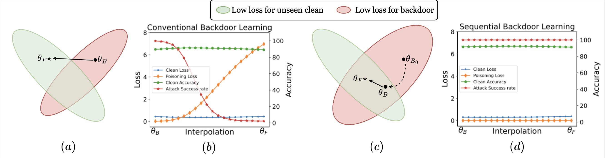

# The official implementation for [ECCV 2024] Flatness-aware Sequential Learning Generates Resilient Backdoors


## Abstract

Recently, backdoor attacks have become an emerging threat to the security of machine learning models. From the adversary's perspective, the implanted backdoors should be resistant to defensive algorithms, but some recently proposed fine-tuning defenses can remove these backdoors with notable efficacy. This is mainly due to the catastrophic forgetting (CF) property of deep neural networks. This paper counters CF of backdoors by leveraging continual learning (CL) techniques. We begin by investigating the connectivity between a backdoored and fine-tuned model in the loss landscape. Our analysis confirms that fine-tuning defenses, especially the more advanced ones, can easily push a poisoned model out of the backdoor regions, making it forget all about the backdoors. Based on this finding, we re-formulate backdoor training through the lens of CL and propose a novel framework, named **S**equential **B**ackdoor **L**earning (**SBL**), that can generate resilient backdoors. This framework separates the backdoor poisoning process into two tasks: the first task learns a backdoored model, while the second task, based on the CL principles, moves it to a backdoored region resistant to fine-tuning. We additionally propose to seek flatter backdoor regions via a sharpness-aware minimizer in the framework, further strengthening the durability of the implanted backdoor. Finally, we demonstrate the effectiveness of our method through extensive empirical experiments on several benchmark datasets in the backdoor domain.

---


Figure 1: *(a) Intuition for fine-tuning defense against conventional backdoor learning (CBL): the backdoored model $\theta_{B}$ is pushed out of backdoor region (red area);
(c) Intuition for the success of our sequential backdoor learning (SBL) framework: $\theta_{B}$ is trapped within the backdoor region that is hard to escape with fine-tuning.
Figure b and d visualize the loss and the accuracy on clean and poisoned test sets of intermediate models when linearly interpolating between backdoored and fine-tuned models with CBL and SBL.*

## Setup
We need the following:
- Conda or miniconda
- Python >= 3.10
- Requirement Libs installed by:
```bash
pip install -r requirements.txt
```


## Run code


### Running BadNets with Resnet18 - CIFAR-10 with EWC
```python
python main.py --dataset cifar10 --backbone resnet18 --cl_method ewc --batch_size 256 --epochs 150 --finetune_epochs 50 --sec_epochs 100 --finetune_lr 0.01 --lr 0.01 --sec_lr 0.001 --task_portion 0.05 0.1 0.85 --poisoning_rate 0.1 --poisoning_method badnet --target_label 0 --trigger_size 3 --num_workers 4 --lr_scheduler CosineAnnealingLR --mixed_first --is_dat --opt_mode sam --p_intervals 1 --wandb_note attack --is_saved --is_load --seed 1
```

### Running BadNets with Resnet18 - CIFAR-10 with EWC
```python
python run_defense.py --dataset cifar10 --backbone resnet18 --cl_method ewc --batch_size 256 --epochs 150 --finetune_epochs 50 --sec_epochs 100 --finetune_lr 0.01 --lr 0.01 --sec_lr 0.001 --task_portion 0.05 0.1 0.85 --poisoning_rate 0.1 --poisoning_method badnet --target_label 0 --trigger_size 3 --num_workers 4 --lr_scheduler CosineAnnealingLR --defenses 'ft' 'nad' 'sam_ft' --mixed_first --is_dat --opt_mode sam --p_intervals 1 --wandb_note defense --is_saved --is_load --seed 1
```

### Running other experiments on CIFAR-10 and GTSRB follows:
```bash
sh run_cifar.sh
sh run_gtsrb.sh
```

